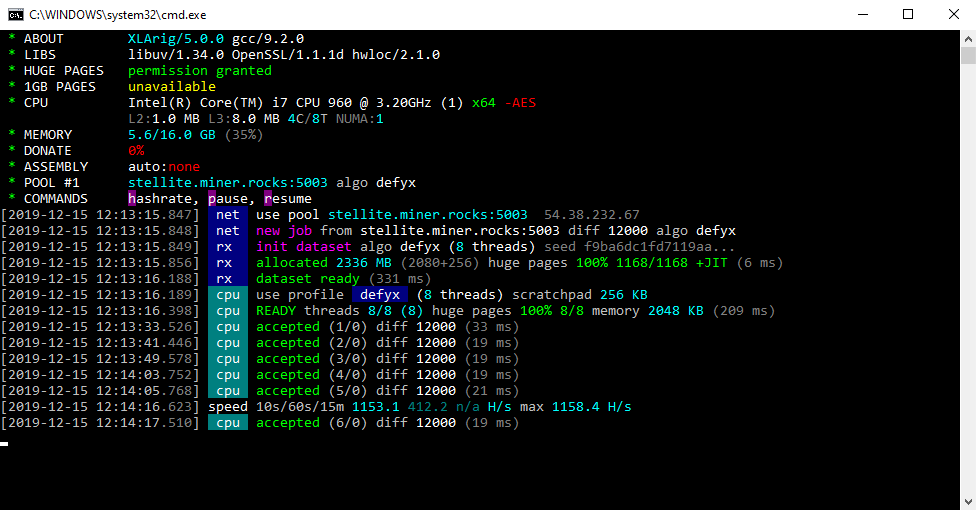

# XLArig

XLArig is a high performance Scala (XLA) CPU miner, with official support for Windows. 
Forked from XMRig for Monero and other cryptonight currencies.



## Download
* Binary releases: https://github.com/scala-network/xlarig/releases
* Git tree: https://github.com/scala-network/xlarig.git
  * Clone with `git clone https://github.com/scala-network/xlarig.git` :hammer: [Build instructions](doc/building.md).

## Usage

The preferred way to configure the miner is the [JSON config file](src/config.json) as it is more flexible and human friendly. The command line interface does not cover all features, such as mining profiles for different algorithms. Important options can be changed during runtime without miner restart by editing the config file or executing API calls.

### Command line options
```
Network:
  -o, --url=URL                 URL of mining server
  -a, --algo=ALGO               mining algorithm https://xmrig.com/docs/algorithms
      --coin=COIN               specify coin instead of algorithm
  -u, --user=USERNAME           username for mining server
  -p, --pass=PASSWORD           password for mining server
  -O, --userpass=U:P            username:password pair for mining server
  -k, --keepalive               send keepalive packet for prevent timeout (needs pool support)
      --nicehash                enable nicehash.com support
      --rig-id=ID               rig identifier for pool-side statistics (needs pool support)
      --tls                     enable SSL/TLS support (needs pool support)
      --tls-fingerprint=HEX     pool TLS certificate fingerprint for strict certificate pinning
      --daemon                  use daemon RPC instead of pool for solo mining
      --daemon-poll-interval=N  daemon poll interval in milliseconds (default: 1000)
  -r, --retries=N               number of times to retry before switch to backup server (default: 5)
  -R, --retry-pause=N           time to pause between retries (default: 5)
      --user-agent              set custom user-agent string for pool
      --donate-level=N          donate level, default 5%% (5 minutes in 100 minutes)
      --donate-over-proxy=N     control donate over xmrig-proxy feature

CPU backend:
      --no-cpu                  disable CPU mining backend
  -t, --threads=N               number of CPU threads
  -v, --av=N                    algorithm variation, 0 auto select
      --cpu-affinity            set process affinity to CPU core(s), mask 0x3 for cores 0 and 1
      --cpu-priority            set process priority (0 idle, 2 normal to 5 highest)
      --cpu-max-threads-hint=N  maximum CPU threads count (in percentage) hint for autoconfig
      --cpu-memory-pool=N       number of 2 MB pages for persistent memory pool, -1 (auto), 0 (disable)
      --cpu-no-yield            prefer maximum hashrate rather than system response/stability
      --no-huge-pages           disable huge pages support
      --asm=ASM                 ASM optimizations, possible values: auto, none, intel, ryzen, bulldozer
      --randomx-init=N          thread count to initialize RandomX dataset
      --randomx-no-numa         disable NUMA support for RandomX
      --randomx-mode=MODE       RandomX mode: auto, fast, light
      --randomx-1gb-pages       use 1GB hugepages for dataset (Linux only)
      --randomx-wrmsr=N         write custom value (0-15) to Intel MSR register 0x1a4 or disable MSR mod (-1)
      --randomx-no-rdmsr        disable reverting initial MSR values on exit

API:
      --api-worker-id=ID        custom worker-id for API
      --api-id=ID               custom instance ID for API
      --http-host=HOST          bind host for HTTP API (default: 127.0.0.1)
      --http-port=N             bind port for HTTP API
      --http-access-token=T     access token for HTTP API
      --http-no-restricted      enable full remote access to HTTP API (only if access token set)

Logging:
  -S, --syslog                  use system log for output messages
  -l, --log-file=FILE           log all output to a file
      --print-time=N            print hashrate report every N seconds
      --health-print-time=N     print health report every N seconds
      --no-color                disable colored output

Misc:
  -c, --config=FILE             load a JSON-format configuration file
  -B, --background              run the miner in the background
  -V, --version                 output version information and exit
  -h, --help                    display this help and exit
      --dry-run                 test configuration and exit
      --export-topology         export hwloc topology to a XML file and exit
```

## Donations
Since the donation mining in XLArig can be turned off, if you wish to help the original creators or the Scala Project team, you can donate with one of the addresses below.

* The Scala Project Team addresses:
  *	XLA : `Ssy2L9U75D2JomhUToLSNQhybW4fDyJCVgaH95UTvRWNEX7UAYdpVrjfbqZuXqj4r3TgSnoiq7mDVRq72BmJtVP93TcAR9oeHJ`
		
* Original Creators addresses: 
  *	XMR: `48edfHu7V9Z84YzzMa6fUueoELZ9ZRXq9VetWzYGzKt52XU5xvqgzYnDK9URnRoJMk1j8nLwEVsaSWJ4fhdUyZijBGUicoD`
  *	BTC: `1P7ujsXeX7GxQwHNnJsRMgAdNkFZmNVqJT`

## Contacts
* hello@scalaproject.io
